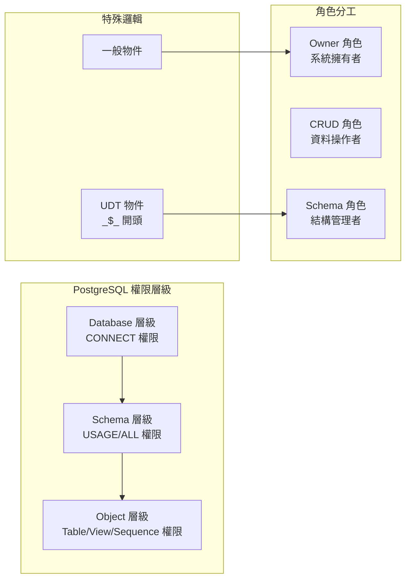
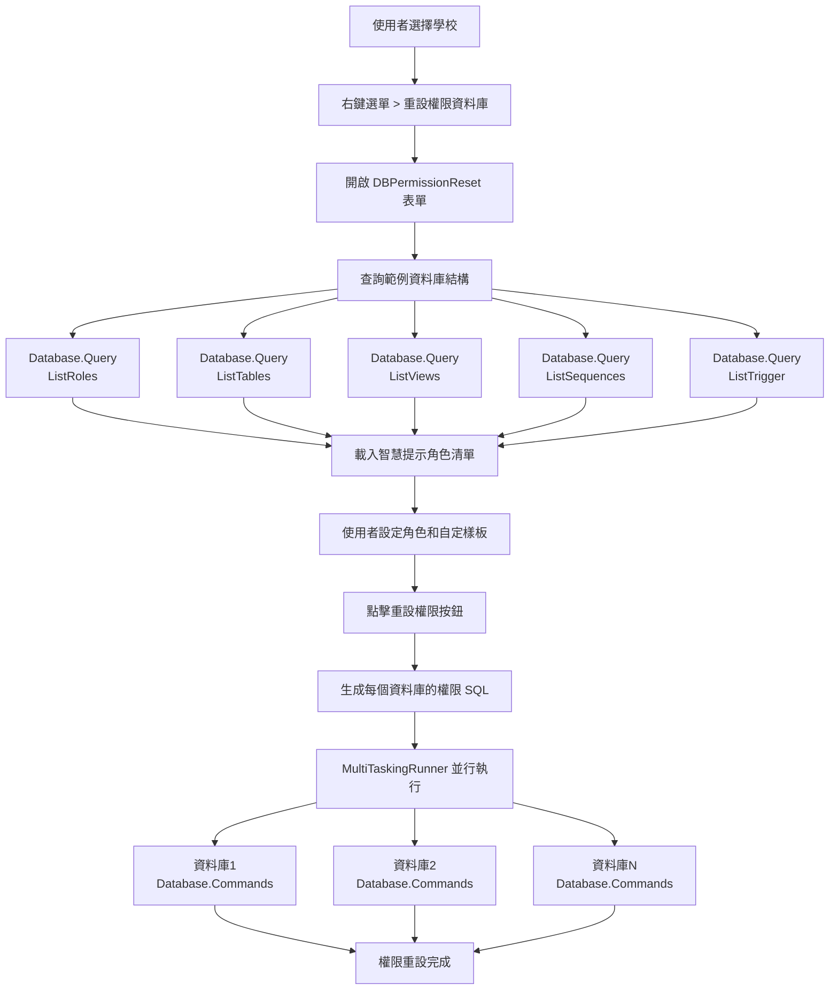
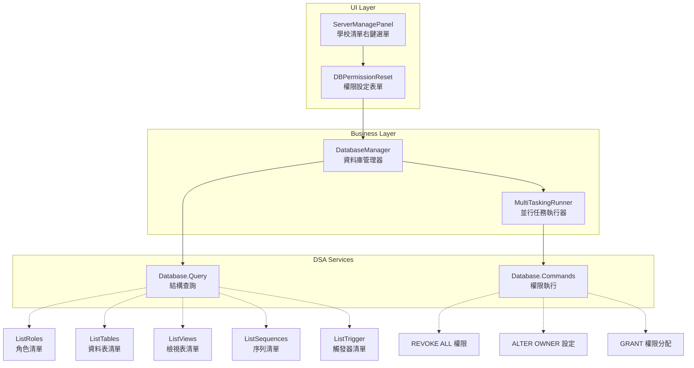

# PostgreSQL 權限重設系統分析

## 📋 概述

「重設權限」是 DSA Server 管理系統中最複雜的功能之一，提供完整的 PostgreSQL 資料庫權限管理機制。此功能可以動態查詢資料庫結構，生成大量的權限管理 SQL 命令，並支援批次處理多個資料庫。

## 🎯 功能觸發與參數

### 觸發位置
- **UI 位置**: `ServerManagePanel` > `School Manager` 頁籤 > 學校清單右鍵選單
- **按鈕名稱**: `mcResetDBPermission` - 「重設權限(資料庫)」
- **啟用條件**: 必須選擇至少一個學校 (`dgvSchoolManageList.SelectedRows.Count > 0`)

### 參數收集邏輯
```csharp
// ServerManagePanel.cs 第821行 - btnResetDBPermission_Click
private void btnResetDBPermission_Click(object sender, EventArgs e)
{
    List<string> dbList = new List<string>();
    foreach (DataGridViewRow row in dgvSchoolManageList.SelectedRows)
        dbList.Add((row.Tag as Application).DatabaseFullName);  // 收集資料庫連線字串

    // 開啟權限重設表單
    new DBPermissionReset(CurrentServer, SelectedApp.DatabaseFullName, dbList).ShowDialog();
}
```

**傳遞參數**:
- `CurrentServer`: 伺服器物件
- `SelectedApp.DatabaseFullName`: 範例資料庫（用於查詢結構）
- `dbList`: 所有要處理的目標資料庫清單

## 🏗️ DBPermissionReset 表單架構

### 核心類別組成
```csharp
public partial class DBPermissionReset : Office2007Form
{
    private ServerManager CurrentServerManager { get; set; }    // 伺服器管理器
    private DatabaseManager DBManager { get; set; }            // 資料庫管理器（範例DB）
    private List<string> TargetDatabases { get; set; }         // 目標資料庫清單
}
```

### UI 元件配置

**角色設定區**:
- `txtOwner`: Owner 角色（擁有者）
- `txtCrud`: CRUD 角色（資料操作）
- `txtSchema`: Schema 角色（結構管理）

**SQL 樣板編輯器**（ActiproSoftware.SyntaxEditor）:
- `sqlDatabase`: 資料庫層級自定 SQL
- `sqlSchema`: Schema 層級自定 SQL
- `sqlTable`: 資料表層級自定 SQL
- `sqlView`: 檢視表層級自定 SQL
- `sqlSequence`: 序列層級自定 SQL
- `sqlTrigger`: 觸發器層級自定 SQL

**智慧提示功能**:
```csharp
// 載入所有角色到 IntelliPrompt 自動完成
List<DatabaseManager.RoleData> roles = DBManager.ListRoles();
roles.ForEach(x => intelli.MemberList.Add(new IntelliPromptMemberListItem(x.Name, x.CanLogin ? 0 : 1)));
```

## 📊 資料庫結構查詢邏輯

### 涉及的 DSA Services

所有查詢都透過 `Database.Query` service，但執行不同的 SQL：

1. **角色查詢**: `DBManager.ListRoles()`
   ```sql
   SELECT rolname, rolcanlogin FROM pg_roles ORDER BY rolcanlogin, rolname;
   ```

2. **資料表查詢**: `DBManager.ListTables()`
   ```sql
   SELECT table_name FROM information_schema.tables WHERE table_schema='public';
   ```

3. **檢視表查詢**: `DBManager.ListViews()`
   ```sql
   SELECT table_name FROM information_schema.views WHERE table_schema='public';
   ```

4. **序列查詢**: `DBManager.ListSequences()`
   ```sql
   SELECT sequence_name FROM information_schema.sequences WHERE sequence_schema='public';
   ```

5. **觸發器查詢**: `DBManager.ListTrigger()`
   ```sql
   SELECT routine_name FROM information_schema.routines
   WHERE routine_schema='public' AND data_type='trigger';
   ```

## ⚙️ 權限重設 SQL 生成邏輯

### 三層權限架構



**1. Database 層級權限**
```sql
-- 撤銷所有角色的資料庫權限
REVOKE ALL ON DATABASE "database_name" FROM "role_name";

-- 設定資料庫擁有者
ALTER DATABASE "database_name" OWNER TO "owner_role";

-- 給予 CRUD 和 Schema 角色連線權限
GRANT CONNECT ON DATABASE "database_name" TO "crud_role";
GRANT CONNECT ON DATABASE "database_name" TO "schema_role";
```

**2. Schema 層級權限**
```sql
-- 撤銷所有角色的 Schema 權限
REVOKE ALL ON SCHEMA public FROM "role_name";

-- 給予使用權限
GRANT USAGE ON SCHEMA "public" TO "crud_role";
GRANT ALL ON SCHEMA "public" TO "schema_role";
```

**3. Object 層級權限**（Table/View/Sequence）

**特殊邏輯 - UDT 物件識別**:
```csharp
if (table.StartsWith("_$_"))
{
    // UDT 物件 - 設定給 Schema 角色管理
    ALTER TABLE "table_name" OWNER TO "schema_role";
}
else
{
    // 一般物件 - 設定給 Owner 角色管理
    ALTER TABLE "table_name" OWNER TO "owner_role";
}
```

**權限分配**:
```sql
-- 撤銷所有現有權限
REVOKE ALL ON "object_name" FROM "role_name";

-- 給予 CRUD 角色資料操作權限
GRANT SELECT, UPDATE, INSERT, DELETE ON TABLE "table_name" TO "crud_role";

-- 給予 Schema 角色完整權限
GRANT ALL ON TABLE "table_name" TO "schema_role";
```

### 自定義樣板系統

**CommandTemplate 類別**:
```csharp
class CommandTemplate
{
    public string ToDatabase { get; set; }   // 資料庫層級自定 SQL
    public string ToSchema { get; set; }     // Schema 層級自定 SQL
    public string ToTable { get; set; }      // 資料表層級自定 SQL
    public string ToView { get; set; }       // 檢視表層級自定 SQL
    public string ToSequence { get; set; }   // 序列層級自定 SQL
    public string ToTrigger { get; set; }    // 觸發器層級自定 SQL
}
```

**樣板變數替換**:
```csharp
// 動態替換樣板中的變數
commands.AppendLine(template.ToDatabase.Replace("@Database", "\"" + db + "\""));
commands.AppendLine(template.ToTable.Replace("@Table", "\"" + table + "\""));
```

## 🚀 批次執行機制

### MultiTaskingRunner 並行處理
```csharp
// 為每個目標資料庫建立並行任務
foreach (string db in TargetDatabases)
{
    runner.AddTask(db, x => {
        DatabaseManager dbman = new DatabaseManager(CurrentServerManager, x.ToString());
        StringBuilder sql = GetResetSqlStatement(dbman, owner, crud, schema, template);
        dbman.ExecuteUpdate(sql.ToString());  // DSA Service: Database.Commands
    }, db, cancellationToken);
}

runner.ExecuteTasks();  // 並行執行所有任務
```

### 錯誤處理機制
- 每個資料庫的權限重設是獨立執行的
- 支援 CancellationToken 中途取消
- 個別資料庫失敗不會影響其他資料庫的處理

## 🎭 完整權限重設流程



## 🔍 關鍵技術特點

1. **動態結構查詢**: 不是硬編碼，而是即時查詢資料庫結構
2. **角色智慧提示**: IntelliPrompt 提供角色名稱自動完成
3. **UDT 物件識別**: 特殊處理使用者定義類型物件
4. **樣板系統**: 支援自定義 SQL 樣板擴展
5. **批次並行處理**: 多資料庫同時處理，提升效率
6. **SQL 語法高亮**: ActiproSoftware 編輯器提供專業體驗

## 🎯 核心 DSA Services 架構



### DSA Services 呼叫統計

| DSA Service | 用途 | 呼叫頻率 |
|-------------|------|----------|
| `Database.Query` | 查詢資料庫結構 | 每個資料庫 5 次（角色+表格+檢視+序列+觸發器） |
| `Database.Commands` | 批次執行權限 SQL | 每個資料庫 1 次（大量 SQL） |

---

📝 **分析完成**: PostgreSQL 權限重設系統的完整實作邏輯，包含動態查詢、SQL 生成和批次執行機制